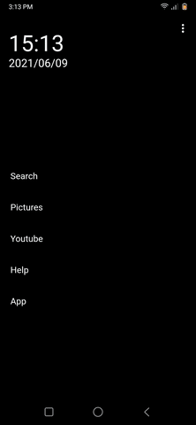

# W Web Launcher

Use webview as Android home screen.

## Change default page

*   Create website and save as index.html
*   You can use other resources such as: images, CSS, JavaScript
*   You can open an app installed in your phone by call function openApp('packageName'), for example: openApp('com.android.dialer')
*   Open menu settings in corner top right and choose folder contain file index.html

## Preview

